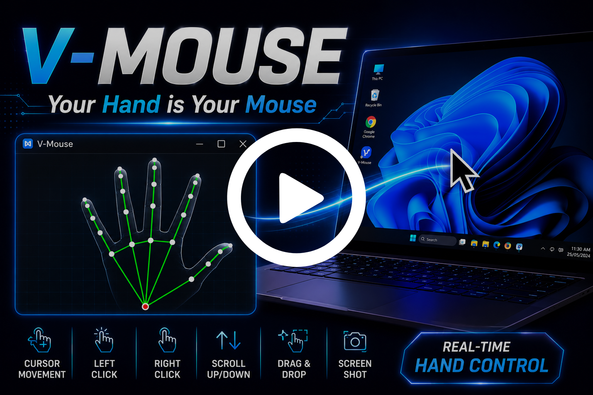
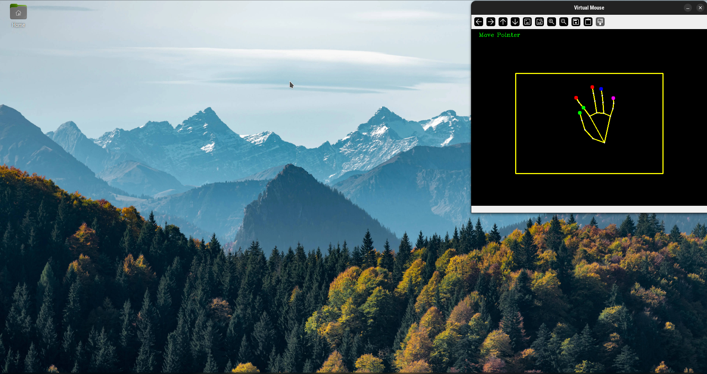
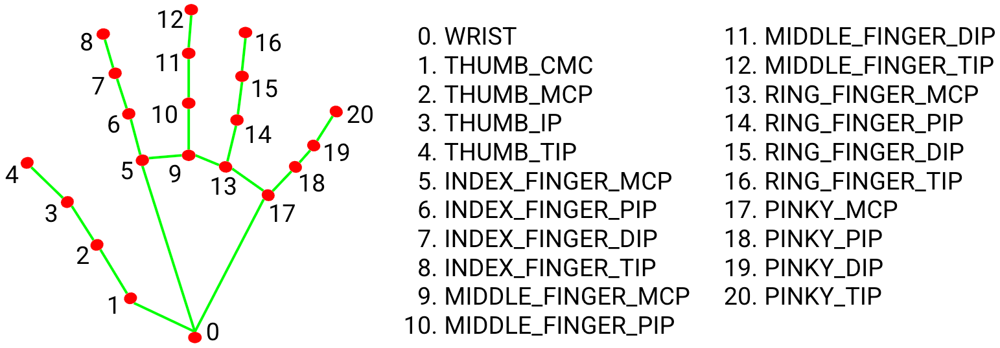

# V-Mouse — Virtual Mouse

Your hand is your mouse. A real-time hand gesture recognition system that replaces your physical mouse with hand movements captured through a webcam.

## Demo

<a href="https://drive.google.com/file/d/1vt72eIsP8f9Jt2nB6dklmLsPedNMGpBO/view?usp=sharing">
  
</a>

<p align="center"><em>Click the thumbnail to watch the full demo</em></p>

## Features

- **Move Pointer** — Bring THUMB_TIP (4) and INDEX_FINGER_PIP (6) together (green dots), then point to move the cursor.
- **Right Click** — Put INDEX_FINGER_TIP (8) down and up. Supports double click.
- **Left Click** — Put MIDDLE_FINGER_TIP (12) down and up.
- **Scroll Down** — Close RING_FINGER_TIP (16) to enter scroll mode, then put INDEX_FINGER_TIP (8) down.
- **Scroll Up** — Close RING_FINGER_TIP (16) to enter scroll mode, then put MIDDLE_FINGER_TIP (12) down (index up).
- **Drag & Drop** — Pinch INDEX_FINGER_TIP (8) and MIDDLE_FINGER_TIP (12) together sideways to grab, move hand to drag, separate to drop.
- **Screenshot** — Close all fingers into a fist, then open your hand to capture.



## Hand Landmarks

The system tracks 21 hand landmarks using MediaPipe to recognize gestures:



> See [docs/gesture_reference.md](docs/gesture_reference.md) for the full gesture guide and [docs/system_architecture.md](docs/system_architecture.md) for the technical deep-dive.

## Installation

### Prerequisites
- Python 3.12+
- Webcam
- Works on **Linux**, **Windows**, and **macOS** (multi-monitor targeting uses `xrandr`, so it's Linux-only — on other platforms the cursor maps to the full screen)

### Setup

```bash
# Clone the repository
git clone https://github.com/Rounak7721/Virtual-Mouse.git
cd Virtual-Mouse

# Create and activate a virtual environment
python -m venv cv_env
source cv_env/bin/activate

# Install dependencies
pip install -r requirements.txt
```

### Run

```bash
cd src
python main.py
```

Press `q` to quit the application.

## Project Structure

```
Virtual-Mouse/
├── src/
│   ├── main.py                 # Entry point — camera loop, gesture-to-action mapping
│   ├── HandOperationModule.py  # MediaPipe wrapper — landmark detection & finger state
│   └── config.py               # All tunable parameters
├── assets/
│   ├── demo/
│   │   └── demo_thumbnail.png  # Demo video thumbnail
│   └── images/
│       ├── hand_landmarks.png  # Landmark reference diagram
│       └── output.png          # Application screenshot
├── docs/
│   ├── system_architecture.md  # Architecture diagrams & data flow
│   └── gesture_reference.md    # Gesture guide & config reference
├── Screenshots/                # Auto-generated screenshots (created at runtime)
├── requirements.txt            # Pinned Python dependencies
└── README.md
```

## Technologies

| Library | Version | Purpose |
|---|---|---|
| [OpenCV](https://opencv.org/) | 4.13.0 | Video capture & frame processing |
| [MediaPipe](https://mediapipe.dev/) | 0.10.14 | Hand landmark detection |
| [PyAutoGUI](https://pyautogui.readthedocs.io/) | 0.9.54 | Cursor movement & scrolling |
| [Pynput](https://pynput.readthedocs.io/) | 1.8.2 | Mouse button press/release |
| [NumPy](https://numpy.org/) | 2.4.4 | Coordinate interpolation |

## Configuration

All parameters can be adjusted in `src/config.py`. See the [Configuration Reference](docs/gesture_reference.md#configuration-reference) for details on each parameter.

## Future Improvements

- Gesture customization for additional functionality
- Enhanced pointer stability and reduced jitter
- Gesture-based keyboard inputs
- Windows / macOS multi-monitor support

## License

This project is licensed under the [MIT License](LICENSE).
