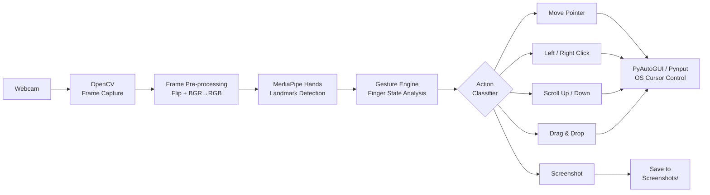
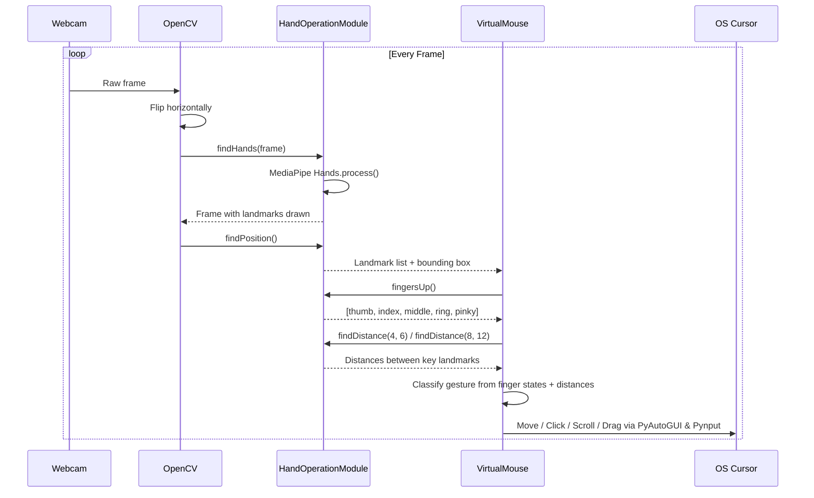

# System Architecture

## Overview

V-Mouse is a real-time hand gesture recognition system that replaces a physical mouse with hand movements captured via a webcam. The system uses MediaPipe for hand landmark detection, maps specific finger configurations to mouse actions (move, click, scroll, drag, screenshot), and controls the OS cursor through PyAutoGUI and Pynput.

## Architecture Diagram



## Module Breakdown

The project consists of three source files, each with a single responsibility:

| Module | Responsibility |
|---|---|
| `main.py` | Application entry point. Owns the main loop, camera lifecycle, and the `VirtualMouse` class that maps gestures to OS actions. |
| `HandOperationModule.py` | Wraps MediaPipe Hands. Provides `findHands()`, `findPosition()`, `fingersUp()`, and `findDistance()` — the four primitives all gesture logic is built on. |
| `config.py` | Central configuration. All tunable parameters (window size, camera ID, sensitivity thresholds, monitor selection) live here. |

## Data Flow



## Gesture Classification Logic

The system uses a two-level decision tree based on landmark distances and finger states:

**Level 1 — Mode Selection** (thumb tip ↔ index PIP distance):
- **< 30px** → Move Pointer mode
- **≥ 30px** → Click / Scroll / Screenshot mode

**Level 2 — Action Selection** (finger up/down states `[thumb, index, middle, ring, pinky]`):

| Finger State | Condition | Action |
|---|---|---|
| Thumb + Index PIP close | distance < 30 | **Move Pointer** |
| Index (8) down, Ring up, Pinky up | `[_, 0, _, 1, !0]` | **Right Click** |
| Middle (12) down, Ring up, Pinky up | `[_, _, 0, 1, !0]` | **Left Click** |
| Ring (16) down, Index (8) down | `[_, 0, _, 0, !0]` | **Scroll Down** |
| Ring (16) down, Middle (12) down, Index up | `[_, 1, 0, 0, !0]` | **Scroll Up** |
| Index (8) + Middle (12) tips close | distance < 27 | **Drag & Drop** |
| All fingers closed (fist) | `[0, 0, 0, 0, 0]` | **Screenshot** |

## Coordinate Mapping

The system maps camera-space coordinates to screen-space using linear interpolation:

```
Screen X = interp(finger_x, [boundary, win_w - boundary], [0, screen_w])
Screen Y = interp(finger_y, [boundary, win_h - boundary], [0, screen_h])
```

A configurable boundary region (`BOUND_R`) reduces the usable camera area to prevent edge jitter. Smoothing (`SMOOTH_FACT`) and a dead zone (`DEAD_ZONE`) further stabilize the cursor.
